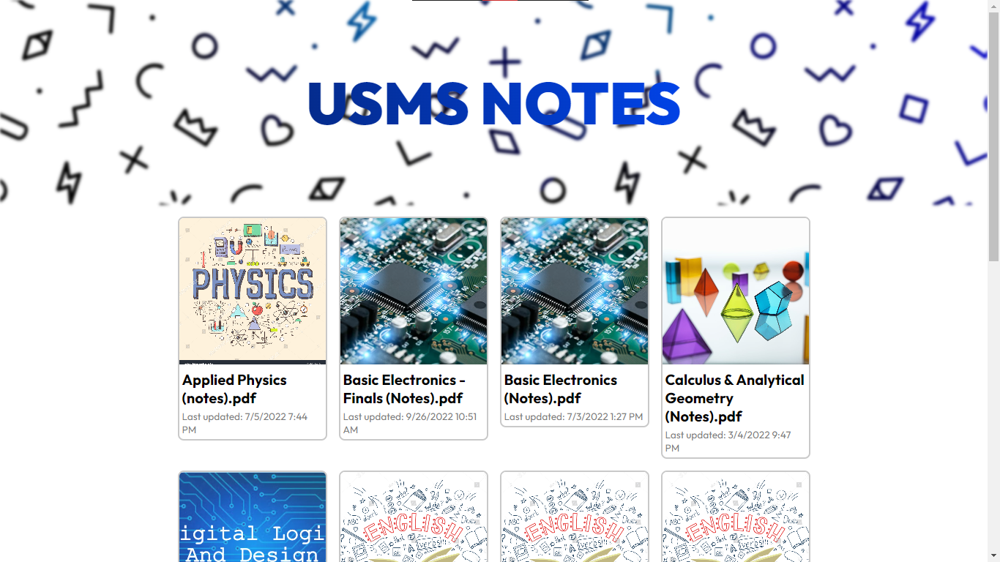

# USMS-Notes

## 📜 Overview
A website to distribute notes for the field of Computer Science

## 🛠 Features
- [x] **Dynamic Content Rendering:** I used JavaScript to dynamically render the content on the screen such as: Cards.
- [x] **Responsive UI:** The UI is optimized and will perform well on smaller screens, as well as larger screens.

## Contributors
- [Abdul Rehman Khan](https://github.com/codewith-ark) - Author.